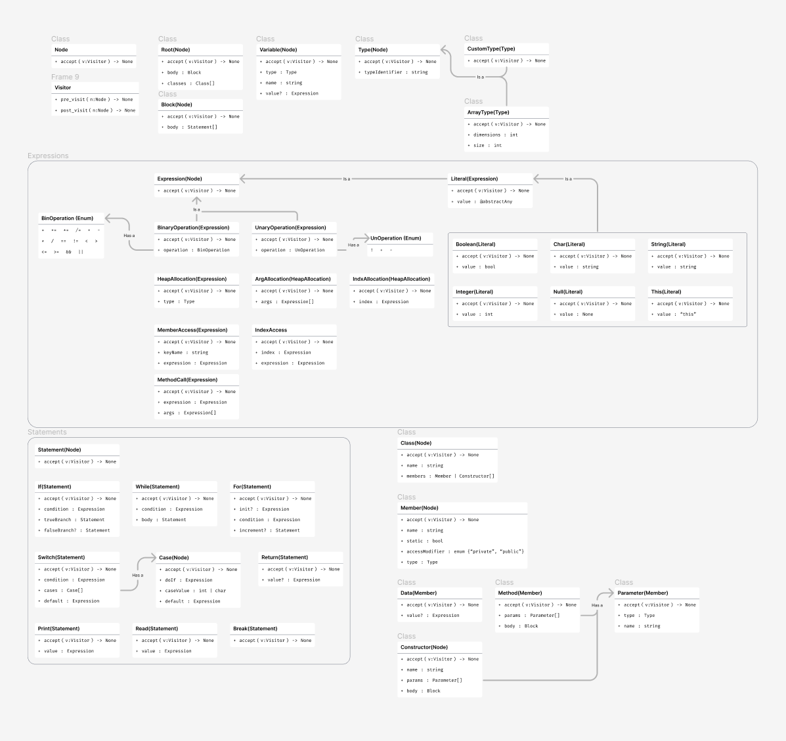

# Parser Design

## Ply Yak notes

### KXI grammary specification

The `*` character is to be treated as a Kleene star in the grammar

### Backus Naur Form

Backus Naur Form (BNF) is a representation of a context free grammar. Ply expects grammar rules to be specified in a modified BNF form. An example set of rules follows

```python3
expression : expression + term
           | expression - term
           | term

term       : term * factor
           | term / factor
           | factor

factor     : NUMBER
           | ( expression )
```

### Encoding Grammar rules for ply

Ply expects a grammar to be defined by a `token` list from the lexical specification and a series of functions.
The functions define the grammar rule in the doc string with a BNF rule

For example

```python3
expression : expression + term
           | exprexssion - term
           | term
```

Would become 3 functions

```python
def p_expression_plus(p):
    'expression : expression PLUS term'
    p[0] = p[1] + p[3]

def p_expression_minus(p):
    'expression : expression MINUS term'
    p[0] = p[1] - p[3]

def p_expression_term(p):
    'expression : term'
    p[0] = p[1]
```

Notice that the words `PLUS` and `MINUS` replace the terminals in the standard BNF format.
Also notice that the actions taken by the function are arbitrary. This example is literally implementing a calculator, I will be building a tree instead.

### the `p` argument

Notice in the above example that the argument p collects the values of the grammar symbols, `p[0]` is the left hand side of the rule, `p[1]` is the righthand expression, `p[2]` is the plus symbol and `p[3]` is the terminal.

> For tokens, the “value” of the corresponding p[i] is the same as the p.value attribute assigned in the lexer module. For non-terminals, the value is determined by whatever is placed in p[0] when rules are reduced.

### Modifying the grammar

I will be taking an iterative approach to modifying the grammar. Ply can help me identify ambiguity and other grammar specification errors and I intend to use this feature while I modify the kxi grammar to be amenable to an LR1 parse.

There are a few obvious modifications I will briefly describe. All usage of the `*` operator will have to be broken into three rules, for example if the rule is

```
a->b*
```

I will replace it with

```
a->b_
b_->b_b
b_->lambda
b->whatever
```

Following is the grammar as I will be encoding it for ply

```md
compilation_unit ::= class_definition_0 VOID MAIN LPAREN RPAREN block
class_definition_0 ::= class_definition_0 class_definition
class_defition_0 ::= lambda
class_definition ::= CLASS identifier LCURLY class_member_definition_0 RCURLY
scalar_type ::= VOID | INT | CHAR | BOOL | STRING| identifier
type ::= scalar_type brackets_0
brackets_0 ::= brackets_0 LSQUARE RSQUARE
brackets_0 ::= lambda
modifier ::= PUBLIC | PRIVATE
class_member_definition_0 ::= class_member_definition_0 class_member_definition
class_member_definition_0 ::= lambda
class_member_definition ::= method_declaration | data_member_declaration | constructor_declaration
data_member_declaration ::= STATIC modifier variable_declaration
data_member_declaration ::= modifier variable_declaration
method_declaration ::= STATIC modifier type method_suffix
method_declaration ::= modifier type method_suffix
constructor declaration ::= method_suffix
method_suffix ::= identifier LPAREN parameter_list RPAREN block
method_suffix ::= indentifier LPAREN RPAREN block
parameter_list ::= parameter parameter_0
parameter_0 ::= COMMA parameter
parameter_0 ::= lambda
parameter ::= type identifier
variable_declaration ::= type identifier initializer
variable_declaration ::= type identifier
initializer ::= EQ expression
statement ::= IF LPAREN expression RPAREN statement ELSE statement
statement ::= IF LPAREN expression RPAREN statement
statement ::= WHILE LPAREN expression RPAREN statement
statement ::= FOR LPAREN for_init_0 expression SEMICOLON for_incr RPAREN statement
for_init_0 ::= expression SEMICOLON
for_init_0 ::= lambda
statement ::= RETURN expression SEMICOLON
statement ::= RETURN SEMICOLON
statement ::= COUT LT LT expression SEMICOLON
statement ::= CIN GT GT expression SEMICOLON
statement ::= SWITCH LPAREN expression RPAREN case_block
statement ::= BREAK SEMICOLON
statement ::= expression SEMICOLON
statement ::= block
statement ::= variable_declaration
block ::= LCURLY statement_0 RCURLY
statement_0 ::= statement_0 statement
statement_0 ::= lambda
case_block ::= LCURLY case_0 DEFAULT COLON statement_0 RCURLY
case_0 ::= case_0 case
case_0 ::= lambda
case ::= CASE INTLIT COLON statement_0
case ::= CASE CHARLIT COLON statement_0
expression ::= expression EQ expression
expression ::= expression PLUSEQ expression
expression ::= expression MINUSEQ expression
expression ::= expression TIMESEQ expression
expression ::= expression DIVIDEEQ expression
expression ::= expression PLUS expression
expression ::= expression MINUS expression
expression ::= expression TIMES expression
expression ::= expression DIVIDE expression
expression ::= expression EQEQ expression
expression ::= expression NOTEQ expression
expression ::= expression LT expression
expression ::= expression GT expression
expression ::= expression LEQ expression
expression ::= expression GEQ expression
expression ::= expression AND expression
expression ::= expression OR expression
expression ::= NOT expression
expression ::= PLUS expression
expression ::= MINUS expression
expression ::= LPAREN expression RPAREN
expression ::= INTLIT
expression ::= CHARLIT
expression ::= STRINGLIT
expression ::= TRUE
expression ::= FALSE
expression ::= NULL
expression ::= THIS
expression ::= identifier
expression ::= NEW type arguments
expression ::= NEW type index
expression ::= expression DOT identifier
expression ::= expression index
expression ::= expression arguments
arguments ::= LPAREN argument_list RPAREN
arguments ::= LPAREN RPAREN
argument_list ::= expression expression_0
expression_0 ::= COMMA expression
expression_0 ::= lambda
index ::= LSQUARE expression RSQUARE
```

Ambiguous grammar speicifcations will present in ply as shift/reduce or reduce reduce conflicts. By default shift/reduce conflicts are resolved in favor of shifting. This would be correct behavior for the classic `dangling else` problem, but won't properly adress all shift/reduce conflicts.

#### Shift/Reduce Conflicts

I should resolve shift-reduce problems by using a precedence variable.

```python
precedence = (
    ('left', 'PLUS', 'MINUS'),
    ('left', 'TIMES', 'DIVIDE'),
)
```

The first argument refers to associativity. Consider the fake `~` operator. If `~` had left associativity then the expression `a ~ b ~ c` would be interpreted as `(a ~ b) ~ c` Whereas if it had right associativity it would be interpreted as `a ~ (b ~ c)`

The example precedence variable means that `PLUS` and `MINUS` have the same precedence level, and `TIMES` and `DIVIDE` have the same precedence level. They are organized from lowest priority to highest in ply yacc.}

The specific ply shift/reduce order is as follows

```md
1. If the current token has higher precedence than the rule on the stack, it is shifted.
2. If the grammar rule on the stack has higher precedence, the rule is reduced.
3. If the current token and the grammar rule have the same precedence, the rule is reduced for left associativity, whereas the token is shifted for right associativity.
4. If nothing is known about the precedence, shift/reduce conflicts are resolved in favor of shifting (the default).
```

                                                                                                                                                                                                        There is also something for "fictitious tokens" The example being a unary minus operator. I will come back to that if necessary.

Lastly there is a non-associativity option which would throw a parsing error for an expression that shouldn't chain. For example if `a+b+c` wasn't allowed for some reason you could specify

```python
precedence = (
    ('nonassoc', 'PLUS),
)
```

and ply would then throw an error if the statement `a+b+c` was ever found.

#### Reduce/Reduce conflicts

Reduce/reduce conflicts are almost always caused by a poor grammar specifcation. They can apparently be difficult to debug.

### Debugging

yacc can produce a file to help debug conflicts. You simply pass the option `yacc.yacc(debug=True)`

### Combining Grammar rules in functions

(probably just don't do this)

The docstrings allow for one function to encode branches in a BNF grammar. The three rules above would become

```python
def p_expression(p):
    '''expression : expression PLUS term
                  | expression MINUS term'''
    if p[2] == '+':
        p[0] = p[1] + p[3]
    elif p[2] == '-':
        p[0] = p[1] - p[3]

def p_expression_term(p):
    'expression : term'
    p[0] = p[1]
```

### Top level rule

By defaul the first rule defined becomes the starting rule for the grammar. If I want to change this I can use a start specifier. More [here](https://ply.readthedocs.io/en/latest/ply.html#changing-the-starting-symbol) If neccessary. I don't anticipate needing this feature, but it may be nice for debugging.

### Error reporting

Most production compilers won't quit after one error, but LR parsing error recovery is difficult and probably not worth it for this project. Write better kxi I guess.

## AST

### Building the AST

ply yacc doesn't return any kind of AST. You can build one yourself though. You would do so by assigning data structures onto `p[0]` that represent the desired AST nodes. The example from the docs is...

```python
class Expr: pass

class BinOp(Expr):
    def __init__(self,left,op,right):
        self.left = left
        self.right = right
        self.op = op

class Number(Expr):
    def __init__(self,value):
        self.value = value

def p_expression_binop(p):
    '''expression : expression PLUS expression
                  | expression MINUS expression
                  | expression TIMES expression
                  | expression DIVIDE expression'''

    p[0] = BinOp(p[1],p[2],p[3])

def p_expression_group(p):
    'expression : LPAREN expression RPAREN'
    p[0] = p[2]

def p_expression_number(p):
    'expression : NUMBER'
    p[0] = Number(p[1])
```

I will be using a Node class similar to the one for the JSONParse assignment. Specifically it will have the ability to work with the visitor pattern, defining an accept method for all nodes.

```python
class Node(ABC):
    @abstractmethod
    def accept(self:Node, v:Visitor):
        pass

class Visitor(ABC):
    @abstractmethod
    def post_visit(self: Visitor, node: Node) -> None:
        pass

    @abstractmethod
    def pre_visit(self: Visitor, node: Node) -> None:
        pass
```

### AST design



The image itself is a bit annoying to update. A link to the live file should be more up to date.

[ast](https://www.figma.com/proto/Z4K1w2PnONXYDoOYIDoP1K/Abstract-Syntax-Tree?type=design&node-id=11-679&t=159TUVwSnwsoP0Jj-0&scaling=min-zoom&page-id=0%3A1)
