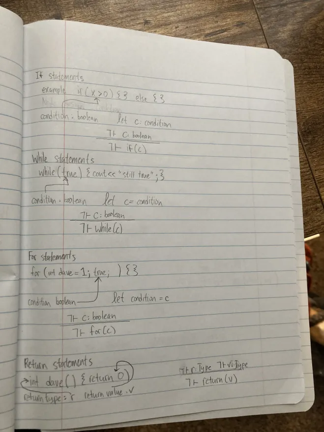
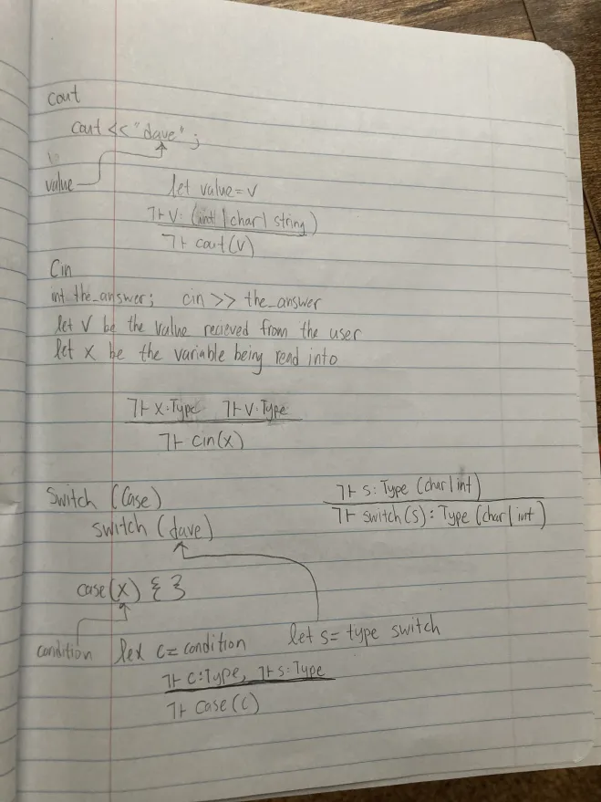
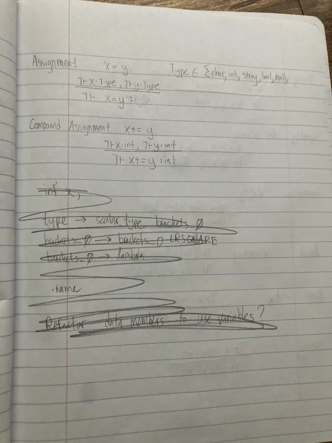
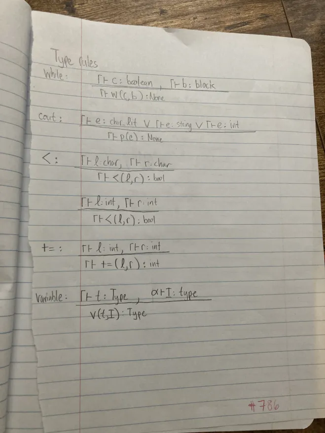
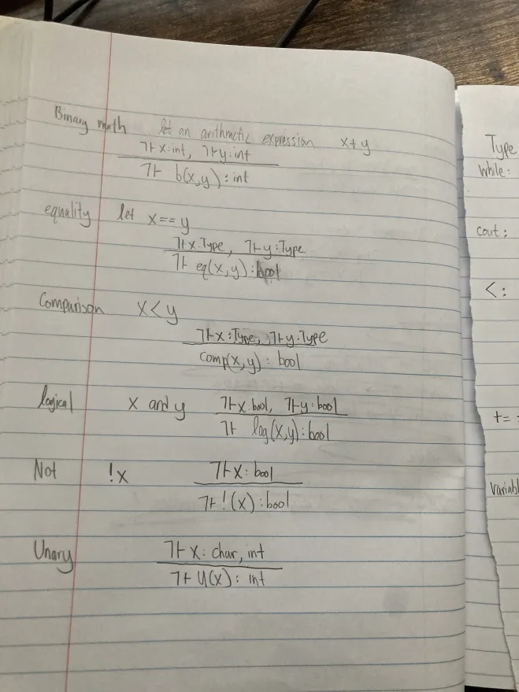
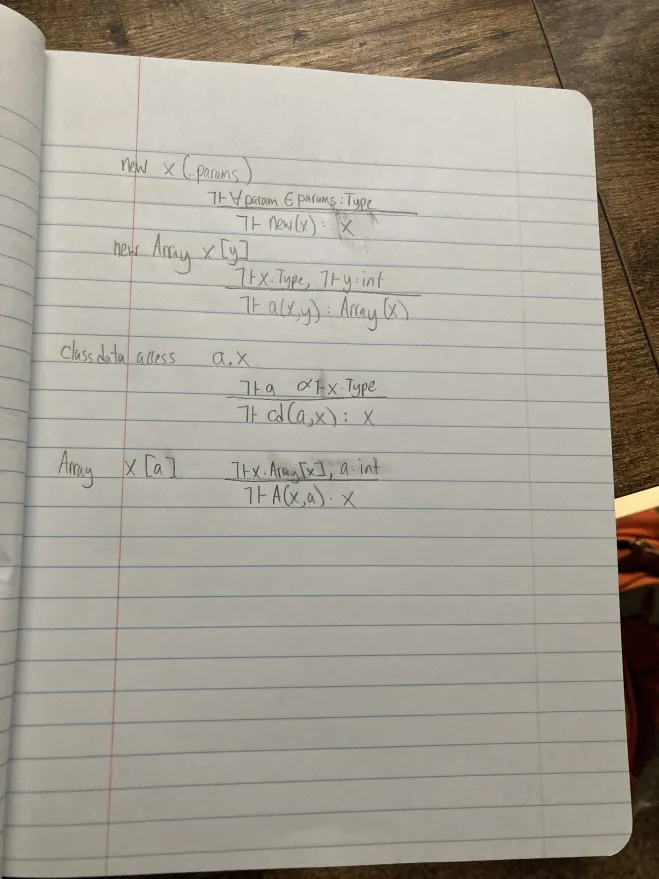
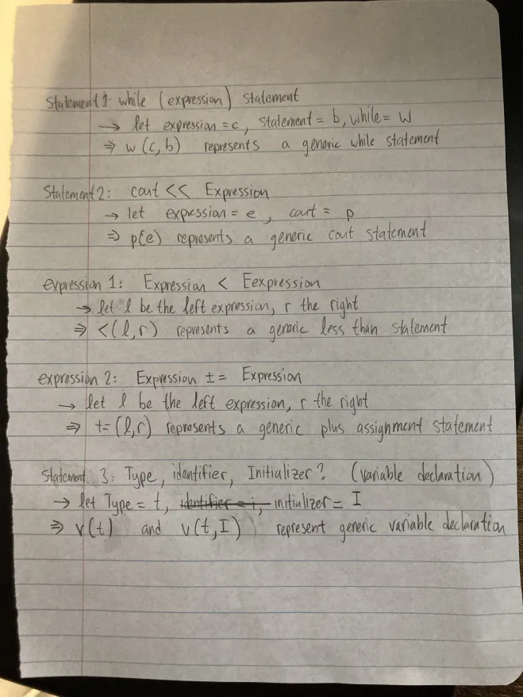

# Semantics

While I now know that the kxi program is syntactically correct. I will need to check that the encoded meaning is sensible before re-writing as assembly code.

## Context aware visitors and inheritance

I will be re-writing my visitors slightly to leverage inheritance better. Rather than using match and cases I will be using methods named for the various nodes.

This will specifically allow me to write a context aware visitor. A context aware visitor will use a stack to keep track of the scope. It will push nodes that define a new block onto the stack when they are pre-visited and pop them off the stack when they are post visited

## The symbol table

I will be using a nested symbol table approach. Each node that has a scope defined will have a way to access the appropriate starting table. The tables themselves will contain ways to access parent scopes with the root having no parent. As I use the symbol table to complete semantic checks if a symbol isn't found I'll traverse up through the parents finally throwing an error if the symbol isn't defined in the root scope.

## Building the symbol table

Using a context aware visitor I will define visiting behavior for each variable node adding it to the symbol table with the appropriate scope. At this time I will store the type of that variable and anticipate eventually having a location for the assembly to look for this variable. Either an offset or a statically defined location in memory. I will also store the access modifier in the symbol table.

Each class method will have its own symbol table including parameters as well as local variables.

## Type checking

Rather than writing a large type checking visitor I will write rough sequent calculus for each statement and expression. This typechecking should keep in mind valid type substitutes, namely nullptr being valid for objects arrays and strings. I also include a summary of what amounts to a correct typecheck since I'm not super confident in my sequent calculus.

Since statements often contain expressions, I will type check expressions first.

## Statements

### If statements

`if(b)` will type check to None if b is a boolean.

### While Statements

`while(x)` will type check to None if x is a boolean.

### For statements

`for(<Statement>; x; <Statement>)` will type check to None if x is a boolean.

### Return statements

`return x` type checks to None if the type of x matches the context required.

### Cout statements

`cout << x` type checks to None if x is of type string, char or int

### Cin statements

`cin >> x` type checks to None if the value recieved from the user matches the type of x.

### Switch statements

Type checking for switch statements actually happens in two steps. It would be useful to modify the switch node to have a type attribute that constrains the type of the case conditions. There will be a visitor for assigning a type to switch statement nodes.

#### Case

### Break statements

No Type checking necessary. A different visitor will handle this one.

### Block statements

No type checking necessary.

### Variable declarations

If there is no initializer there is no type checking necessary.

## Expressions

### Assignment

`x=y` type checks to None if the type of x and y match

### Compound assignment

`+=, -=, *=, /=`
`x+=y` will type check to None if x and y are of type int

### BinaryMath

`+ - * /`
`x+y` type checks to int if x and y are both int type.

### Equality

`== !=`
`x==y` type checks to boolean if the type of x and y match.

### Comparison

`< > <= >=`
`x<y` type checks to bollean if the type of x and y match and are either char or int type.

### Logical operators

`&& ||`
`x&&y` type checks to bool if x and y are of type bool.

### Not

`!`
`!x` type checks to boolean if x is of type bool

### Unary +,-

`+x` type checks to int if x is a char or an int.

### Parenthesis

`()`
I don't think type checking is necessary for parenthesis. It might need to be an int?

### new Class

`new x(...params)` type checks if all the params match the required type from the class definition.

### new Array

`new int x[y]` type checks if x is some defined type and y is an integer

### Class data access

`x.y` type checks to y if in the context of class X member y exists

### Array index access

`x[a]` type checks to the array type if a is type integer and x is an ArrayType

### Class method call

`x.a(...params)`
Class method calls type check if in the context of class X all the params match the required type.

## Invalid writes

For each assignment operator check that the assignee is an LValue, in other words that it may be assigned onto.

## Invalid Break statements

make sure that ever break statement occurs in the context of a for while or switch statement.

